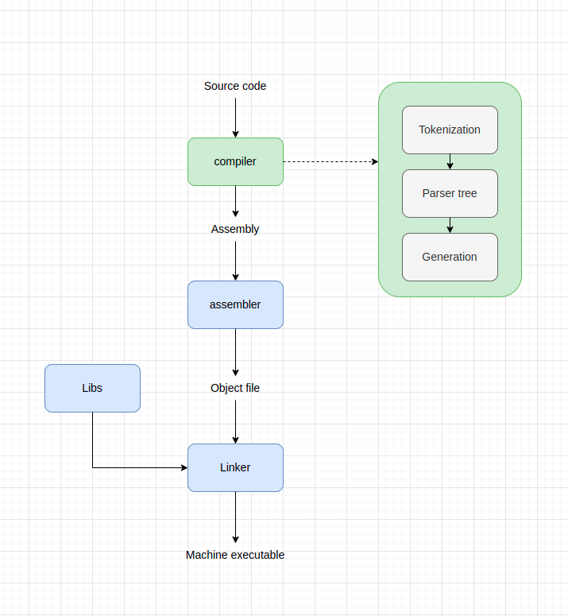

## OnlyFan language - Java compiler

- I call this language is `OnlyFan` because maybe I am the only one use this.
- This program using compiler written by `Java`.
### 1. Requirement
Your machine need to set up:
+ `Java` JDK 17
+ `nasm` to assemble `assembly`
+ `ld` in linux to link object file
### 2. Compile
Test `OnlyFan` in `./resouce/in.of`

Compiling `OnlyFan` code by Intellij JDK or command:
```
javac src/src/main/java/compiler/Main.java && \
java -cp src/src/main/java/ compiler.Main
```
Then `OnlyFan` code will compile to machine code in `./build`

Run machine code by command: 
```
./build/out     // Execute machine code
echo $?         // check exit code
```
### 3. Simple compiler system
We only focus on building compiler


